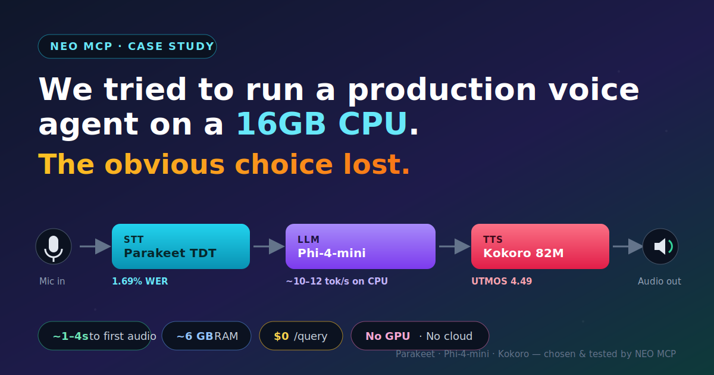
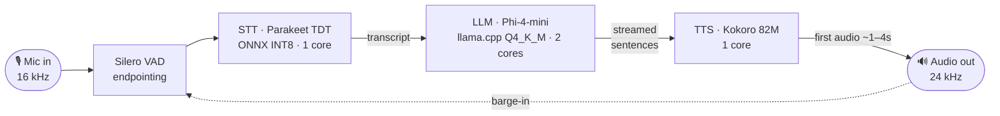

# We Tried to Run a Production Voice Agent on a 16GB CPU. The Obvious Choice Lost.



*An engineering investigation: how NEO MCP benchmarked 6 open-source speech models, reversed its own recommendation when the evidence turned, and shipped a tested pipeline — no GPU, no cloud, $0 per query.*

---

Every team building voice AI eventually asks the same uncomfortable question: **do we really need a GPU and a cloud bill to ship this?**

We decided to find out — rigorously. We handed [NEO MCP](https://docs.heyneo.com/neo-mcp) a single brief: *find the best open-source speech-to-speech pipeline that runs on a 16GB, CPU-only laptop for a production voice research assistant, and prove it.*

What came back wasn't just an answer. It was a reversal, a sensitivity analysis, and working code. Here's the story.

## The setup

A voice assistant is three models in a trench coat:

**Speech-to-Text (STT) → Large Language Model (LLM) → Text-to-Speech (TTS)**

We gave NEO two "obvious" candidate stacks:

| | STT | LLM | TTS |
|---|---|---|---|
| **A — Performance** | Parakeet TDT 0.6B | Qwen3-4B | Kokoro 82M |
| **B — Efficiency** | Moonshine | Phi-4-mini | Piper |

The constraints: 16GB RAM, no GPU, near-real-time interaction, fully open-source.

## What we expected to win

If you handed this brief to ten experienced engineers, most would pick Pipeline A — and they'd be right to, on paper.

Pipeline A is the quality play, and every component is a category leader:

- **Parakeet TDT** sits at #1 on the HuggingFace Open ASR Leaderboard with a **1.69% WER** — the best open transcription accuracy available. For a *research* assistant fielding technical terms, code names, and citations, transcription errors compound into bad answers. You want the best STT you can afford.
- **Qwen3-4B** isn't just a strong 4B model — it has a **thinking mode**, switchable chain-of-thought reasoning that measurably lifts answer quality on hard questions. For a research assistant, "thinks before it answers" sounds like exactly the right trade.
- **Kokoro 82M** tops the TTS Arena with a near-human UTMOS of 4.49. For long, spoken research answers, voice quality is what keeps a user listening.

So the initial hypothesis was reasonable, even obvious: **maximize quality at each stage, accept a little extra latency, and you get the best research assistant.** Our first-pass recommendation was Pipeline A. The instinct — "pick the best model at each stage" — is how most of us were trained to think.

It was also wrong. Here's the number that broke it.

## The finding that changed everything

The feature we were most excited about — Qwen3's thinking mode — was the feature that sank it.

**What we expected:** thinking mode adds *some* latency in exchange for better reasoning. A few extra seconds for a smarter answer. A good deal for research.

**The evidence:** thinking mode doesn't produce an answer — it first emits **hundreds to thousands of hidden reasoning tokens**, then the answer. On a GPU, that overhead disappears into parallel throughput. On a **CPU at ~6 tokens/second**, it doesn't disappear anywhere. NEO did the arithmetic everyone skips:

> **⏱ The latency math**
> ```
> Reasoning tokens (hidden):   500 – 2,000 tokens
> CPU generation speed:        ~6 tokens / second
> ───────────────────────────────────────────────
> Thinking overhead:           ~85 – 330 seconds   (before the answer even starts)
> + Answer (≈100–300 tokens):  ~15 – 50 seconds
> ───────────────────────────────────────────────
> Total per query:             ~1 – 8 minutes
> ```
> Same model on a GPU: a second or two. The bottleneck isn't the model — it's *serial* token generation on a CPU.

A question that should take ~30 seconds balloons to **1–8 minutes**. Not slow — *broken*. No user waits eight minutes to hear a spoken reply.

**The revised conclusion:** the single feature that made Pipeline A the favorite makes it unusable on CPU. Worse, it's not a tuning problem — it's intrinsic to running chain-of-thought on a serial processor. The "best" model had disqualified itself on the one constraint that mattered most: near-real-time interaction.

That's the moment the investigation turned. NEO **reversed its own recommendation** and went looking for the stack that survives the CPU, not just the leaderboard.

## The winner: a hybrid nobody shipped

The best pipeline wasn't either vendor bundle. It was a best-of-breed hybrid NEO assembled itself:

> **🎙️ Parakeet TDT 0.6B (INT8) → 🧠 Phi-4-mini-instruct (Q4_K_M) → 🔊 Kokoro 82M**

- **STT:** Parakeet's 1.69% WER — 2.7× better than Moonshine.
- **LLM:** Phi-4-mini-instruct at ~10–12 tok/s on CPU (50% faster than Qwen3), with the ~2% MMLU gap imperceptible on most queries.
- **TTS:** Kokoro's near-human voice (UTMOS 4.49), with **sentence-level streaming** so the user hears the first words in ~1–4 seconds.

It runs in **~6 GB of RAM**, costs **$0 per query**, and scored **8.5/10** — winning across *every* weighting in a sensitivity analysis.

## Why we rejected the runner-up (and the others)

A recommendation is only trustworthy if you can see why the alternatives lost. None of these are bad stacks — each is the *right* answer under different constraints.

**Pipeline A — Parakeet → Qwen3-4B → Kokoro (the quality play).**
*What it did well:* best-in-class on every axis — top STT, strongest reasoning, best voice. *Why it lost:* thinking mode is unusable on CPU (1–8 min/query); with thinking *off*, Qwen3's ~6 tok/s still trails Phi-4-mini's ~10–12, so you pay a latency penalty for a ~2% quality gain you can't hear. *When it's actually right:* the moment you have a GPU, or you run reasoning **offline/async** ("deep research, answer me in 5 minutes"). Then thinking mode becomes a feature, not a trap.

**Pipeline B — Moonshine → Phi-4-mini → Piper (the efficiency play).**
*What it did well:* the fastest, lightest option — Piper's near-zero TTS latency and Moonshine's tiny footprint make it the snappiest end to end. *Why it lost:* Moonshine's ~4.5% WER is 2.7× worse than Parakeet and it has **no published noise data** — risky for a research assistant parsing technical vocabulary. Piper's voice is noticeably more robotic for long answers. *When it's actually right:* hard sub-15s latency requirement, clean audio, short utterances, or even tighter RAM than 16GB. For a kiosk or command interface, B wins.

**Pipeline D — Parakeet → Qwen3-4B (thinking off) → Kokoro (the compromise).**
*What it did well:* keeps the top STT and TTS, drops the thinking tax. *Why it lost:* it's just Pipeline C with a slower LLM. Same accuracy and voice, ~50% slower generation, for a quality delta that's imperceptible on most queries. *When it's actually right:* if you specifically need Qwen3's multilingual breadth or its slightly higher ceiling on the hardest reasoning prompts.

The hybrid (C) won not because it's best at any single thing, but because it's the only one with **no disqualifying weakness** under the actual constraints.

## What would change our recommendation

This recommendation is conditional, not eternal. Here's exactly what flips it:

| If this changes… | …the recommendation becomes |
|---|---|
| **A GPU becomes available** | Pipeline A. Thinking mode's token overhead vanishes under parallel throughput — reasoning quality is suddenly free, so take it. |
| **Latency stops mattering** (batch/async use) | Pipeline A, or C with thinking enabled. If a 2–5 min answer is fine, spend the compute on reasoning. |
| **Voice quality matters more** | Stay on C/Kokoro and *don't* consider Piper; if budget allows, move TTS to a larger model — but Kokoro already leads open-source. |
| **Reasoning quality matters more** | Qwen3 (A/D), or run a larger LLM if RAM allows — accept the latency hit consciously. |
| **Memory tightens (<16GB)** | Pipeline B. Moonshine + Piper shave several GB; you trade transcription accuracy and voice for headroom. |
| **Latency tightens (hard <5s)** | Pipeline B — and even then, accept that no CPU stack truly hits real-time; you're optimizing perceived latency via streaming. |

The point: there is no universally best stack. There's a best stack **for a constraint set**, and ours is "16GB, CPU-only, research-grade, near-real-time."

## What an engineer should deploy today

If you want to ship this now, here's the concrete configuration — no further analysis required.

**The stack**
> 🎙️ Parakeet TDT 0.6B v2 (ONNX INT8) → 🧠 Phi-4-mini-instruct (GGUF Q4_K_M, llama.cpp) → 🔊 Kokoro 82M



**Quantization & engines**

| Stage | Model / format | Engine | On disk | RAM |
|---|---|---|---|---|
| STT | Parakeet TDT 0.6B, ONNX **INT8** | ONNX Runtime (CPU) | ~640 MB | ~1.2–1.5 GB |
| LLM | Phi-4-mini-instruct, GGUF **Q4_K_M** | llama.cpp `llama-server` | ~2.3 GB | ~2.8–3.2 GB |
| TTS | Kokoro 82M | Kokoro / PyTorch (CPU) | ~350 MB | ~0.4–0.5 GB |

**Hardware:** 4-core x86-64 CPU, 16GB RAM, ~3GB free disk. No GPU.
**Thread split (4 cores):** 2 → LLM, 1 → STT, 1 → TTS.
**Expected latency:** time-to-first-audio **~1–4s** with sentence-level TTS streaming; total **~9–28s** (short query). True <5s real-time is *not* achievable on CPU — design around perceived latency, not total.
**Expected memory:** **~6 GB** of 16GB in steady state, leaving comfortable headroom for a single session.

**Non-negotiables for the latency story to hold:**
1. **Stream TTS at sentence boundaries** — this is what buys the ~1–4s TTFA. The LLM emits tokens serially over many seconds; if you wait for the *whole* response before synthesizing, the user hears nothing until the end. Instead, detect the first completed sentence, synthesize it immediately, and keep generating in the background — the user is already listening while the model is still writing.
2. **Keep thinking mode off** in the interactive path; expose it only as an explicit async "deep research" mode.
3. **Cap responses** (~256 tokens) and pre-warm all three models at startup.

**Upgrade path:** higher-quality quant (Q5_K_M/Q6) if RAM allows → AVX-512/optimized runtimes → GPU or NPU offload (which also unlocks thinking mode) → swap in newer checkpoints (e.g. Qwen3-4B-Instruct-2507, or Phi-4-mini-reasoning for the async deep-research mode).

## Two lessons that generalize

1. **Benchmark the constraint, not the model.** A leaderboard tells you which model is "best" in a vacuum; it says nothing about whether it survives *your* hardware. The decisive number here — thinking-mode token overhead at CPU speeds — appears on no leaderboard. Always re-derive the metrics against your actual deployment target.
2. **The best system is the one with no disqualifying weakness.** We didn't pick the best STT, the best LLM, or the best TTS. We picked the combination that had no fatal flaw under the constraints — which turned out to be a hybrid neither vendor shipped.

## What NEO actually contributed

It's tempting to read this as "NEO collected benchmark numbers." It didn't — anyone with a browser can collect numbers. NEO contributed the **engineering reasoning** that turns numbers into a decision:

- **It challenged its own assumption.** NEO's first recommendation was Pipeline A. When pushed to cost the *latency* of the feature it relied on, it didn't defend the answer — it modeled thinking-token overhead on CPU and **let the evidence overturn its own conclusion**.
- **It discovered an architecture nobody specified.** Neither candidate stack was the answer. NEO synthesized a **hybrid** — best STT + fastest viable LLM + best TTS — that wasn't on the original menu.
- **It pressure-tested the verdict.** Rather than assert "C is best," NEO ran a **sensitivity analysis** across six weighting profiles (latency-first, quality-first, balanced…) and showed C wins all but one extreme tie — so the recommendation is robust, not a function of how you weight the criteria.
- **It mapped the boundary conditions.** It enumerated exactly *what would change the recommendation* (GPU, latency relaxation, memory) instead of presenting a single context-free winner.
- **It closed the loop into code.** NEO then scaffolded and tested the winning pipeline — **39/39 tests passing** — taking the project from question to running software.

A human sat in the *reviewer's* chair, not the researcher's. The full loop — **research → recommend → reverse on evidence → prove robustness → ship tested code** — and the willingness to overturn its own first answer when the math demanded it, is the difference between a search summary and an engineering decision.

## Steal this checklist

Running your own local-AI deployment decision? Here's the method that produced this one:

- [ ] **State the constraint set first** (hardware, latency target, budget, licensing) — before looking at any model.
- [ ] **List the leaderboard favorites**, then **re-derive their key metrics on your target hardware** — especially latency.
- [ ] **Cost the "free" features** (thinking modes, large contexts, high-quality quant) in *your* tokens/second, not the vendor's.
- [ ] **Separate perceived latency from total latency** — design for time-to-first-output (here, stream TTS by sentence).
- [ ] **Consider hybrids** — the best per-stage model rarely comes pre-bundled.
- [ ] **Run a sensitivity analysis** — if your winner only wins under one weighting, it's fragile.
- [ ] **Write down what would change the verdict** — so the decision is reusable, not a one-off.
- [ ] **Prove it with a smoke test** before you commit — a recommendation you haven't run is a hypothesis.

## Try it

```bash
git clone <repo>
cd tts_cpu
./scripts/download_models.sh
pip install -r requirements.txt
python main.py chat --text-only   # no audio hardware needed
```

Full benchmark report (24 sections, cost analysis, risk register, upgrade path): [`speech_pipeline_benchmark_report.md`](./speech_pipeline_benchmark_report.md)

---

## Built with NEO MCP

This case study — the research, the analysis, and the working code — was produced by **NEO MCP**, an autonomous AI/ML engineering agent that researches, reasons, recommends, and ships tested code.

- 📖 **Docs:** [docs.heyneo.com/neo-mcp](https://docs.heyneo.com/neo-mcp)
- 🧩 **VS Code:** [marketplace.visualstudio.com/items?itemName=NeoResearchInc.heyneo](https://marketplace.visualstudio.com/items?itemName=NeoResearchInc.heyneo)
- 🖱️ **Cursor:** [marketplace.cursorapi.com/items/?itemName=NeoResearchInc.heyneo](https://marketplace.cursorapi.com/items/?itemName=NeoResearchInc.heyneo)
